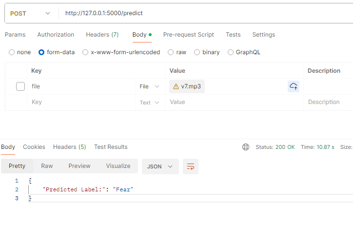

# Speech Emotion Recognition

This repository contains implementations of Convolutional Neural Network (CNN), Long Short-Term Memory (LSTM), and Bi directinal LSTM models for speech emotion recognition. The models are trained on four datasets: SAVEE, TESS, CREMA-D, and Ravdess, to classify seven emotions: Anger, Disgust, Fear, Happiness, Sadness, Surprise, and Neutral.

## Dataset Sources

- **SAVEE (Surrey Audio-Visual Expressed Emotion)**: Recorded by four English-speaking men (DC, JE, JK, KL) aged 27 to 31. Emotions categorized into seven classes.

- **TESS (Toronto Emotional Speech Set)**: Contains audio clips of North American English speakers expressing emotions.

- **CREMA-D (Crowd-sourced Emotional Multimodal Actors Dataset)**: Features video clips of 91 actors delivering sentences expressing various emotions at different intensity levels.

- **Ravdess (Ryerson Audio-Visual Database of Emotional Speech and Song)**: Includes audiovisual recordings of professional actors portraying various emotions.

## Model Architecture

Three types of models are implemented:

- **Convolutional Neural Network (CNN)**: Learns spatial features from the spectrogram representations of audio signals.
  
- **Long Short-Term Memory (LSTM)**: Captures temporal dependencies in sequential data like speech.

- **Bi-Directional LSTM**
## Usage

1. **Data Preprocessing**: Perform necessary preprocessing steps such as feature extraction (e.g., MFCCs), normalization, and dataset splitting.

2. **Model Training**: Train the CNN, LSTM, and CLSTM models on the preprocessed datasets using appropriate training procedures and hyperparameters.

3. **Evaluation**: Evaluate the trained models on validation and test sets using metrics like accuracy, precision, recall, and F1-score.

4. **Inference**: Use the trained models to predict emotions in new audio samples.

### Dataset Link
[https://www.kaggle.com/code/saddamazyazy/unmasked-face-mask-with-gan/input](https://www.kaggle.com/datasets/dmitrybabko/speech-emotion-recognition-en)

### Showing Predictions

To demonstrate the effectiveness of the model, here are some examples of images generated by the trained model:

